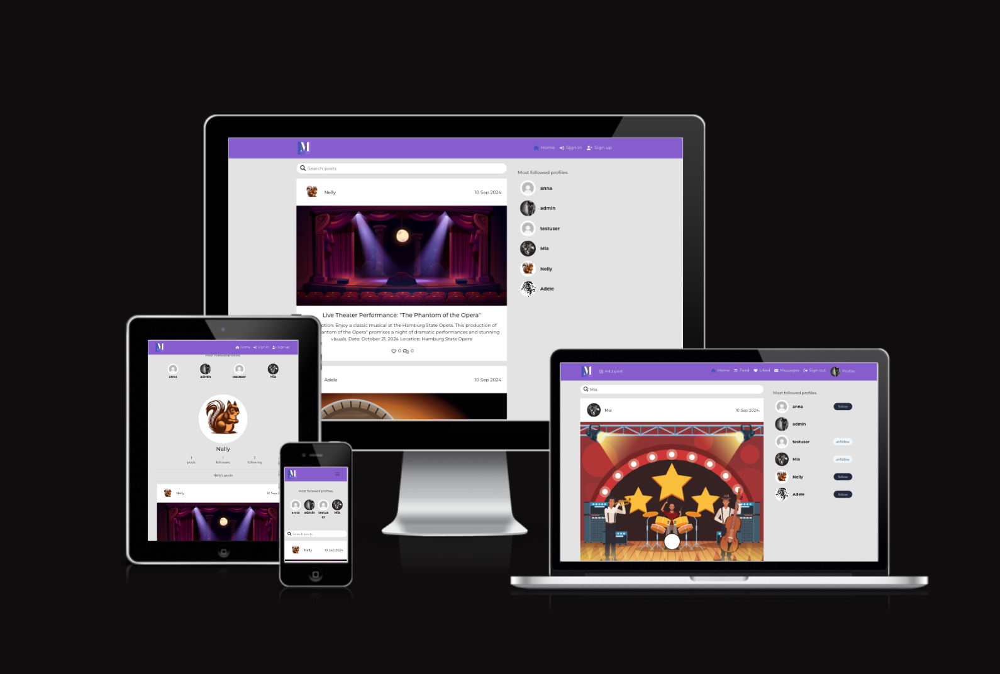
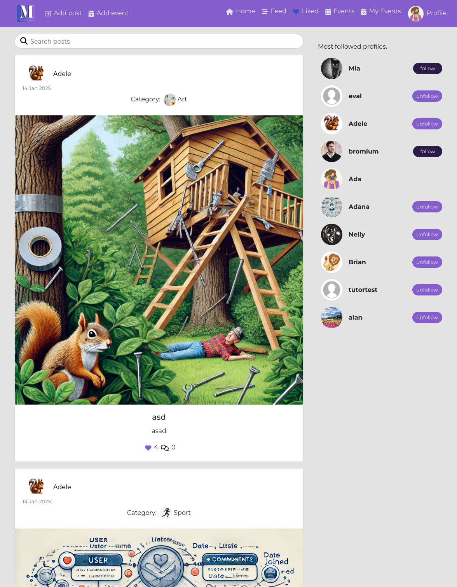
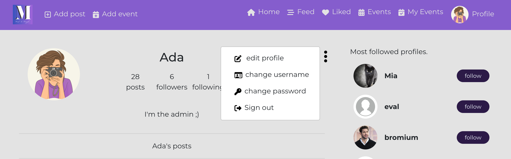

# Meet&Mingle

Meet&Mingle is a social platform designed for organizing and hosting both in-person and virtual events, activities, and gatherings, bringing together individuals and communities who share common interests, hobbies, or professional backgrounds.

Visit the deployed website here → [Meet&Mingle](https://meetandmingle-01eaa763465e.herokuapp.com/) 
Visit the API repository here → [API](https://github.com/Ann-Anahit/drf_api) 
The User Stories you can see here → [GitHub Project](https://github.com/users/Ann-Anahit/projects/5)

## Content

* [User Experience](#user-experience-ux)
    * [Site Objectives](#site-objectives)
    * [User Stories](#user-stories)
* [Design](#design)
    * [Website Structure](#website-structure)
    * [Wireframes](#wireframes)
    * [Color Scheme](#color-scheme)
    * [Typography](#typography)
* [Features and Future Features](#features-and-future-features)
    * [Features](#features)
    * [Future Features](#future-features)
* [Technologies Used](#technologies-used)
    * [Installed packages, libraries and components](#installed-packages-libraries-and-components)
* [Deployment, Fork and Clone](#deployment-fork-and-clone)
    * [Deployment](#deployment)
    * [Fork](#how-to-fork)
    * [Clone](#how-to-clone)
* [Testing](#testing)
* [Bugs](#bugs)
    * [Known Bugs](#known-bugs)
* [Credits](#credits)
* [Content](#content)
* [Acknowledgments](#acknowledgments)

## User Experience (UX)

User Experience (UX) centers on how users engage with and perceive a website. For a platform like Meet&Mingle, which brings together people with shared interests, UX is about ensuring that the process of discovering and joining events is seamless, intuitive, and enjoyable.

### Site Objectives

Defining the site objectives involves understanding what the website aims to achieve. Objectives might include:

* Connect Users: Enable users to easily connect with others who share similar interests.
* Event Management: Provide tools for users to create, manage, and RSVP to events effortlessly.
* Community Building: Cultivate a sense of belonging and interaction among the user base.
* Engagement: Promote regular participation and active involvement through engaging features.

### User Stories

#### First Time User

A first-time user is someone visiting the site for the first time. Their story might involve:

* Onboarding: Discovering what the site is about, how to sign up, and what benefits it offers.
* Exploration: Browsing available events to understand what’s available.
* Registration: Creating an account and setting up a profile.
* Initial Engagement: Finding and joining a first event.

#### Returning User

A returning user is someone who has visited the site before but isn't necessarily a frequent user. Their story might involve:

* Re-engagement: Logging in to see new events or updates from previously joined events.
* Profile Management: Updating personal information or preferences.
* Event Participation: RSVPing to upcoming events or managing existing event participation.
* Write messages with other User

#### Frequent User

A frequent user regularly interacts with the site. Their story might involve:

* Active Participation: Regularly creating, managing events.
* Community Interaction: Engaging with other users through comments.

[Back to top](<#content>)

## Design

### Website Structure

 I decided to take a straightforward approach and create a website similar to Walkthrough Moments. However, instead of focusing on sharing images, my site will engage users through events and activities.
 I also added a messaging tool to the platform, but unfortunately, it currently only functions in the backend. It doesn't yet work properly on the frontend.

### Wireframes

I chose Figma to create the wireframes for both mobile and desktop versions of the website. You can view them by clicking the button below.

MEET&MINGLE 

  

[Back to top](<#content>)

### Color Scheme

The color palette used in this website seems to have been chosen to evoke certain emotions, enhance user experience, and align with the brand identity. Here's a breakdown of the possible reasons behind the choice of each color:

- **Black** `#050505` - Black is often associated with elegance, simplicity, and professionalism. It might be used for text or backgrounds, providing contrast to make other elements stand out.

- **Sapphire**  `#104DB2` - Blue shades like sapphire often symbolize trust, reliability, and calmness. This could be used for buttons or important action elements to give users a sense of security.

- **Byzantine Blue**  `#3854BD` - A slightly lighter blue that could provide variation in the blue tones across the website, keeping the design visually interesting without overwhelming the user. Blue is also associated with communication and clarity.

- **Amethyst**  `#855DCD`- Purple is associated with creativity, imagination, and luxury. This color could be used to highlight certain sections or elements that inspire creativity or give the site a modern, artistic feel.

- **Lavender (Floral)**  `#C36BE4` - Lavender is often linked to calmness, compassion, and refinement. It’s a softer color that complements the darker tones, giving the design a balanced feel and making it inviting.

- **Platinum**  `#E3E3E3`- A neutral, light color often used for backgrounds or secondary elements. Platinum provides balance in contrast to the more vibrant colors and allows for readability and a clean, minimalistic feel.

Overall, this color palette creates a harmonious blend of trustworthiness, creativity, and professionalism, while maintaining an inviting and balanced aesthetic for users. Each color has a distinct role, and together they contribute to an engaging and visually appealing user experience.

[Back to top](<#content>)

### Typography

I chose the font [Montserrat](https://fonts.google.com/specimen/Montserrat?query=Montserrat) for everything  and as a fall back font, sans-serif.

[Back to top](<#content>)

## Features and Future Features

### Features

This is a multi-page website. On each page we have:

- A favicon.

- A navigation bar and links that change if the user is logged in or not.

[Back to top](<#content>)

### The Home Page

On the home page the user can see a posts and the navigation bar.

[Back to top](<#content>)

### The Sign Up Page

The user needs to provide a username and password to register, and confirm this password to reinforce security.

[Back to top](<#content>)

### The Sign In Page
 Page

With correct username and password, the user can access their profile.

[Back to top](<#content>)

### The Posts Feed

The posts feed is the main page of the website, where the user can see all the events offered by other users. This page has infinite scroll.

### The Create Post Form

Here the user needs to provide a title, description, date, time and image to create a post.

[Back to top](<#content>)

### Liked Page

This page is reserved for posts/events that the user has favorited because they are interested.

[Back to top](<#content>)

### Messages Page

Unfortunately, the messages frontend is not working yet.

### My Profile

Account user profile page. If you are the user of the account, you can see the button to follow other users. If it's a visitor to your page, they can see the posts you've created below your profile, as well as how many people you follow, your bio and photo.

[Back to top](<#content>)

### Edit Profile Menu

As an user you can edit some information about your account.

[Back to top](<#content>)

### Edit Posts Page

Here the user can edit the posts and change text.

[Back to top](<#content>)

### Future Features

This project is incredibly complex for me, offering the potential for remarkable improvements. Here are a few areas where I believe we can make significant enhancements:

* Enhance the messaging system: Facilitating seamless communication between users.
* Integrate Google Maps API: Providing users with easy access to event locations.
* Implement a notification system: Keeping users informed through timely updates on the website and app.
* Establish group functionality: Allowing users to create and participate in groups for better collaboration.
With these enhancements, we can truly elevate the project's performance and user experience!

[Back to top](<#content>)

## Technologies Used

- HTML5 to create the website structure.
- CSS3 to style the website.
- JavaScript to create the interactions on the website.
- [Git](https://git-scm.com/) for version control.
- [GitPod](https://www.gitpod.io/) as IDE to create the website.
- [GitHub](https://github.com/) to store files for the website.
- [Figma](https://www.figma.com/) to create the wireframes.
- [Chat GPT](https://chat.openai.com/) to generate fictional texts.
- [Google Fonts](https://fonts.google.com/) to import the font used on the website.
- [Logo](https://favicon.io/) to create favicon.
- [Am I Responsive?](https://ui.dev/amiresponsive) to display the website image across various devices.
- [PostgreSQL](https://www.postgresql.org/) through Code Institute databases.
- [Heroku](https://www.heroku.com/) to deploy this project.
- [Cloudinary](https://cloudinary.com/) to store the images uploaded on the website.

## Installed packages, libraries and components

- **React**:
    - The primary JavaScript framework for developing the user interface.

- **React-Bootstrap**:
    - A library that provides pre-styled React components based on Bootstrap, allowing for quicker and more consistent UI development.

- **Node**:
    - A package manager used for installing project dependencies.

- **React Router**:
    - Manages the routing for the React application. It ensures the UI stays in sync with the URL and only renders components required by the current URL path.

- **Axios library**:
    - Facilitates the React app in making HTTP requests to the API.

- **React Infinite Scroll**:
    - Utilized on list pages to enable infinite scrolling instead of traditional pagination.

- **jwtDecode library**:
    - Prevents unnecessary network requests whenever an unauthenticated user interacts with the app.
    - Stores the refresh token's timestamp for the logged-in user in the browser using localStorage.
    - Checks for the existence of this timestamp and only attempts to refresh the access token if it is present.

[Back to top](<#content>)

## Deployment, Fork and Clone

### Deployment

The application has been deployed from GitHub to Heroku by following the steps:

1. Create or log in to your account at [Heroku](https://www.heroku.com/).
2. Create a new app, add a unique app name and then choose your region.
3. Click on Create App.
4. Go to "Settings".
5. Under Config Vars add a key "PORT" and value "8000".
6. Add required buildpacks (further dependencies). For this project, set it up so Python will be on top and Node.js on bottom.
7. Go to "Deploy" and select "GitHub" in "Deployment method".
8. To connect Heroku app to your Github repository code enter your repository name, click "Search" and then "Search" when it shows below.
9. Choose the branch you want to build your app from.
10. If preferred, click on "Enable Automatic Deploys", which keeps the app up to date with your GitHub repository.
11. Wait for the app to build. Once ready you will see the “App was successfully deployed” message and a "View" button to take you to your deployed link.

[Back to top](<#content>)

### How to Fork

1. Log in to GitHub.
2. Go to the repository for the project.
3. Click the Fork button in the top right corner.

### How to Clone

1. Log in to GitHub.
2. Go to the repository for the project.
3. Click on the **green code button** and select if you would like to clone with HTTPS, SSH or GitHub CLI and copy the link below.
4. Navigate to the directory where you want to clone the repository and open terminal.
5. Type *git clone* into the terminal and paste the link you have from number 3. Press enter. This command will download the entire repository to your local machine.

[Back to top](<#content>)

## Testing

Performed tests can be found in [TESTING.md](TESTING.md).

[Back to top](<#content>)

## Bugs

### Known Bugs

- The only error so far is the messaging tool. Unfortunately, the messaging frontend is not working yet.

[Back to top](<#content>)

## Credits

- All the features of my website were developed with the guidance of the lessons from the Code Institute's Moments project.

## Content

- The default profile is provided by Code Institute in the Django Rest Framework walkthrough project and I reused them.
- The other images on the website were downloaded from [Vecteezy](https://de.vecteezy.com/).

## Acknowledgments

I would like to acknowledge:
- Kay Welfare - My cohort facilitator who's always there for us.
- My sister and Tristan, for understanding. 

[Back to top](<#content>)
