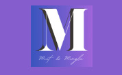
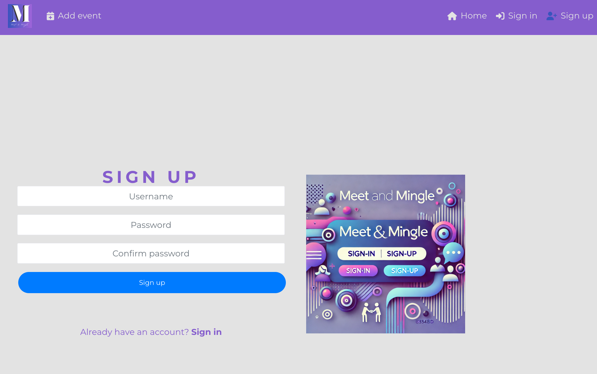
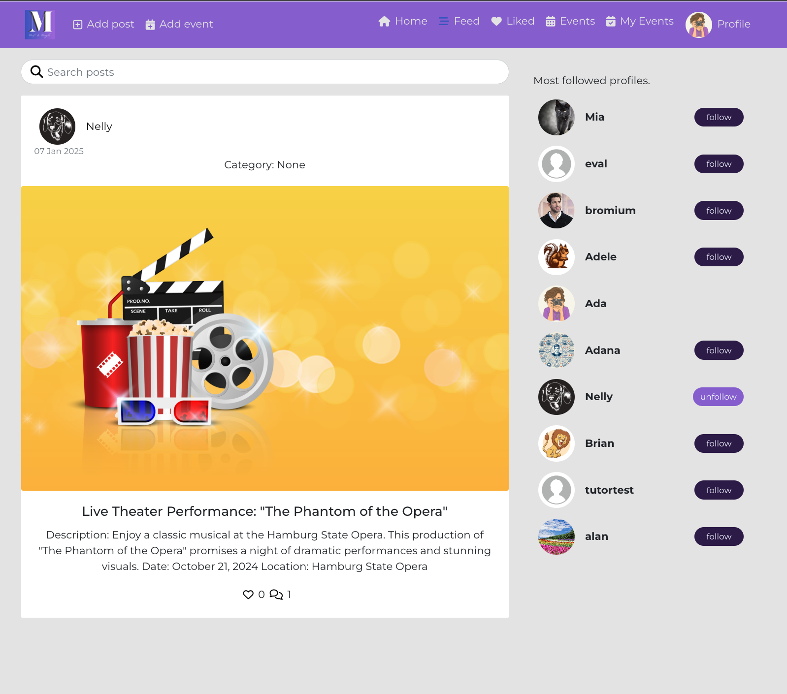
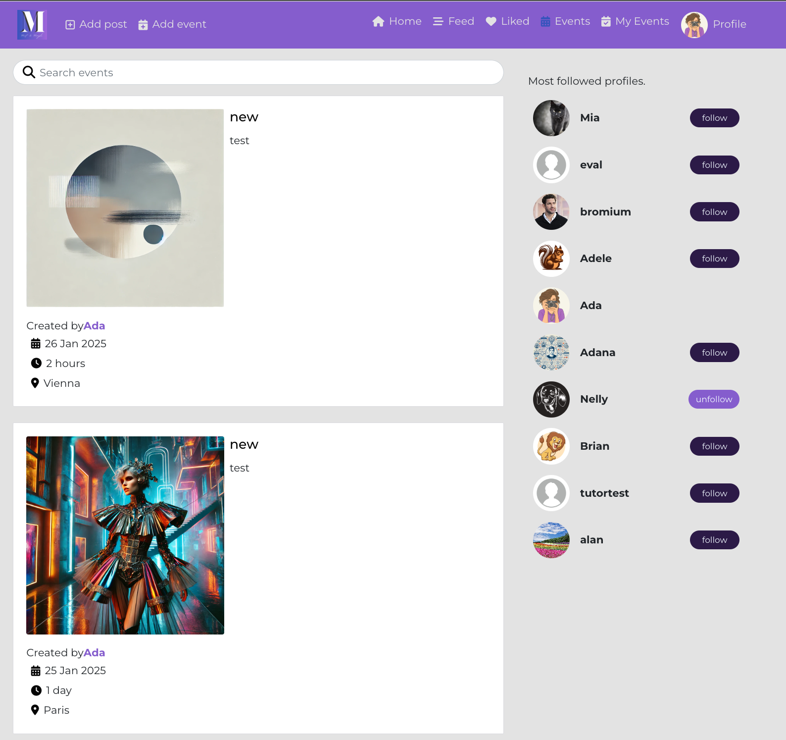
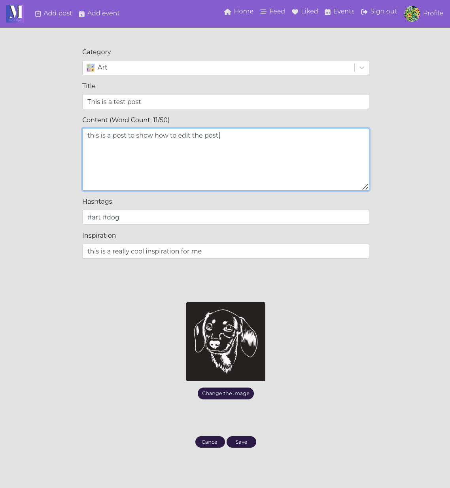

# Meet&Mingle

Meet&Mingle is a social platform designed for organizing and hosting both in-person and virtual events, activities, and gatherings, bringing together individuals and communities who share common interests, hobbies, or professional backgrounds.

Visit the deployed website here → [Meet&Mingle](https://meetandmingle-01eaa763465e.herokuapp.com/) 
Visit the API repository here → [API](https://github.com/Ann-Anahit/drf_api) 
The User Stories you can see here → [GitHub Project](https://github.com/users/Ann-Anahit/projects/5)

## Content

* [User Experience](#user-experience-ux)
    * [Site Objectives](#site-objectives)
    * [User Stories](#user-stories)
* [Design](#design)
    * [Website Structure](#website-structure)
    * [Wireframes](#wireframes)
    * [Color Scheme](#color-scheme)
    * [Typography](#typography)
* [Features and Future Features](#features-and-future-features)
    * [Features](#features)
    * [Future Features](#future-features)
* [Technologies Used](#technologies-used)
    * [Installed packages, libraries and components](#installed-packages-libraries-and-components)
* [Deployment, Fork and Clone](#deployment-fork-and-clone)
    * [Deployment](#deployment)
    * [Fork](#how-to-fork)
    * [Clone](#how-to-clone)
* [Testing](#testing)
* [Bugs](#bugs)
    * [Known Bugs](#known-bugs)
* [Credits](#credits)
* [Content](#content)
* [Acknowledgments](#acknowledgments)

## User Experience (UX)

User Experience (UX) centers on how users engage with and perceive a website. For a platform like Meet&Mingle, which brings together people with shared interests, UX is about ensuring that the process of discovering and joining events is seamless, intuitive, and enjoyable.

### Site Objectives

Defining the site objectives involves understanding what the website aims to achieve. Objectives might include:

* Event and post Management: Provide tools for users to create, manage, and RSVP to events and posts effortlessly.
* Connect Users: Enable users to easily connect with others who share similar interests.
* Community Building: Cultivate a sense of belonging and interaction among the user base.
* Engagement: Promote regular participation and active involvement through engaging features.

### User Stories

#### First Time User

A first-time user is someone visiting the site for the first time. Their story might involve:

* Onboarding: Discovering what the site is about, how to sign up, and what benefits it offers.
* Exploration: Browsing available events to understand what’s available.
* Registration: Creating an account and setting up a profile.
* Initial Engagement: Finding and joining a first event and a first post.

#### Returning User

A returning user is someone who has visited the site before but isn't necessarily a frequent user. Their story might involve:

* Re-engagement: Logging in to see new events or updates from previously joined events and posts.
* Profile Management: Updating personal information or preferences.
* Follow the other users and see the upcoming events.
* Read the posts, comment, like and dislike the posts. 

#### Frequent User

A frequent user regularly interacts with the site. Their story might involve:

* Active Participation: Regularly creating, managing events.
* Community Interaction: Engaging with other users through comments.

[Back to top](<#content>)

## Design

### Website Structure

I chose a straightforward approach to design my website, drawing inspiration from Walkthrough Moments. However, instead of centering around sharing images, my platform focuses on engaging users through events and activities.
The admin has the ability to manage categories for posts via the backend, with each category including a name and an image. Additionally, I introduced an event feature to the platform, offering distinct functionality compared to regular posts. Users can create events by providing details such as the event start time, duration, location, title, description, and an accompanying image. This added tool enhances interactivity and user engagement on the site.

### Wireframes

I chose Figma to create the wireframes for both mobile and desktop versions of the website. You can view them by clicking the button below.

MEET&MINGLE 

  

[Back to top](<#content>)

### Color Scheme

The color palette used in this website seems to have been chosen to evoke certain emotions, enhance user experience, and align with the brand identity. Here's a breakdown of the possible reasons behind the choice of each color:

- **Black** `#050505` - Black is often associated with elegance, simplicity, and professionalism. It might be used for text or backgrounds, providing contrast to make other elements stand out.

- **Sapphire** `#104DB2` - Blue shades like sapphire often symbolize trust, reliability, and calmness. This could be used for buttons or important action elements to give users a sense of security.

- **Byzantine Blue** `#3854BD` - A slightly lighter blue that could provide variation in the blue tones across the website, keeping the design visually interesting without overwhelming the user. Blue is also associated with communication and clarity.

- **Amethyst** `#855DCD`- Purple is associated with creativity, imagination, and luxury. This color could be used to highlight certain sections or elements that inspire creativity or give the site a modern, artistic feel.

- **Lavender (Floral)** `#C36BE4` - Lavender is often linked to calmness, compassion, and refinement. It’s a softer color that complements the darker tones, giving the design a balanced feel and making it inviting.

- **Platinum** `#E3E3E3`- A neutral, light color often used for backgrounds or secondary elements. Platinum provides balance in contrast to the more vibrant colors and allows for readability and a clean, minimalistic feel.

Overall, this color palette creates a harmonious blend of trustworthiness, creativity, and professionalism, while maintaining an inviting and balanced aesthetic for users. Each color has a distinct role, and together they contribute to an engaging and visually appealing user experience.

[Back to top](<#content>)

### Typography

I chose the font [Montserrat](https://fonts.google.com/specimen/Montserrat?query=Montserrat) for everything  and as a fall back font, sans-serif.

[Back to top](<#content>)

## Features and Future Features

### Features

This is a multi-page website. On each page we have:

- A favicon.

- A navigation bar and links that change if the user is logged in or not.

- The log out button is located in the profile menu items.

[Back to top](<#content>)

### The Sign Up Page

The user needs to provide a username and password to register, and confirm this password to reinforce security.

### The Sign In Page

With correct username and password, the user can access their profile.

### The Home Page

The Homepage is the main page of the website where the user can read about the side and see the actual posts offered by all users. the first image shows for the sign in users, the second the sign out users

[Back to top](<#content>)

### The Posts Feed

The posts feed is designed to keep users connected with the content that matters to them. When a user follows others, their feed dynamically displays posts from those users, ensuring a personalized and engaging experience. This page also features infinite scrolling, allowing seamless exploration of content without interruptions..

### The Liked Page

This page is reserved for posts that the user has liked.

### The Events Page

This page is reserved for all events.

### The MyEvents Page

This page is reserved for all events from the logged in user.

### The Eventdetail Page

On this page the user can edit or delete the own created event.

### The Create Post Form

On this page, the user needs to provide a post category, title, description, hashtags, inspiration, and an image to create a post.

### Edit Post Form

Here the user can edit the own post.

[Back to top](<#content>)

### The Create Event Form

Here the user needs to provide a title, description, even-start, event-duration, location and an image to create an event.

### Edit Event Form

Here the user can edit the own event.

[Back to top](<#content>)

### The Profile Page

This is the account user profile page. If you are the user of the account, you can see the buttons to follow other users. If it's a visitor to your page, they can see the posts you've created below your profile, as well as how many people you follow, your bio and photo.

[Back to top](<#content>)

### Edit Profile Menu

As an user you can edit some information about your account.

[Back to top](<#content>)

### Future Features

This project is incredibly complex for me, offering the potential for remarkable improvements. Here are a few areas where I believe we can make significant enhancements:

* Enhance the messaging system: Facilitating seamless communication between users.
* Integrate Google Maps API: Providing users with easy access to event locations.
* Implement a notification system: Keeping users informed through timely updates on the website and app.
* Establish group functionality: Allowing users to create and participate in groups for better collaboration.
With these enhancements, we can truly elevate the project's performance and user experience!

[Back to top](<#content>)

## Technologies Used

- HTML5 to create the website structure.
- CSS3 to style the website.
- JavaScript to create the interactions on the website.
- [Git](https://git-scm.com/) for version control.
- [GitPod](https://www.gitpod.io/) as IDE to create the website.
- [GitHub](https://github.com/) to store files for the website.
- [Figma](https://www.figma.com/) to create the wireframes.
- [Chat GPT](https://chat.openai.com/) to generate fictional texts.
- [Google Fonts](https://fonts.google.com/) to import the font used on the website.
- [Logo](https://favicon.io/) to create favicon.
- [Am I Responsive?](https://ui.dev/amiresponsive) to display the website image across various devices.
- [PostgreSQL](https://www.postgresql.org/) through Code Institute databases.
- [Heroku](https://www.heroku.com/) to deploy this project.
- [Cloudinary](https://cloudinary.com/) to store the images uploaded on the website.

## Installed packages, libraries and components

- **React**:
    - The primary JavaScript framework for developing the user interface.

- **React-Bootstrap**:
    - A library that provides pre-styled React components based on Bootstrap, allowing for quicker and more consistent UI development.

- **Node**:
    - A package manager used for installing project dependencies.

- **React Router**:
    - Manages the routing for the React application. It ensures the UI stays in sync with the URL and only renders components required by the current URL path.

- **Axios library**:
    - Facilitates the React app in making HTTP requests to the API.

- **React Infinite Scroll**:
    - Utilized on list pages to enable infinite scrolling instead of traditional pagination.

- **jwtDecode library**:
    - Prevents unnecessary network requests whenever an unauthenticated user interacts with the app.
    - Stores the refresh token's timestamp for the logged-in user in the browser using localStorage.
    - Checks for the existence of this timestamp and only attempts to refresh the access token if it is present.

[Back to top](<#content>)

## Deployment, Fork and Clone

### Deployment

The application has been deployed from GitHub to Heroku by following the steps:

1. Create or log in to your account at [Heroku](https://www.heroku.com/).
2. Create a new app, add a unique app name and then choose your region.
3. Click on Create App.
4. Go to "Settings".
5. Under Config Vars add a key "PORT" and value "8000".
6. Add required buildpacks (further dependencies). For this project, set it up so Python will be on top and Node.js on bottom.
7. Go to "Deploy" and select "GitHub" in "Deployment method".
8. To connect Heroku app to your Github repository code enter your repository name, click "Search" and then "Search" when it shows below.
9. Choose the branch you want to build your app from.
10. If preferred, click on "Enable Automatic Deploys", which keeps the app up to date with your GitHub repository.
11. Wait for the app to build. Once ready you will see the “App was successfully deployed” message and a "View" button to take you to your deployed link.

[Back to top](<#content>)

### How to Fork

1. Log in to GitHub.
2. Go to the repository for the project.
3. Click the Fork button in the top right corner.

### How to Clone

1. Log in to GitHub.
2. Go to the repository for the project.
3. Click on the **green code button** and select if you would like to clone with HTTPS, SSH or GitHub CLI and copy the link below.
4. Navigate to the directory where you want to clone the repository and open terminal.
5. Type *git clone* into the terminal and paste the link you have from number 3. Press enter. This command will download the entire repository to your local machine.

[Back to top](<#content>)

## Testing

Performed tests can be found in [TESTING.md](TESTING.md).

[Back to top](<#content>)

## Credits

- Most of the features of my website were developed with the guidance of the lessons from the Code Institute's Moments project.

## Content

- The images on the website were downloaded from [Vecteezy](https://de.vecteezy.com/).

## Acknowledgment

- I would like to begin by expressing my heartfelt thanks to my brother David Zakharyan, who gave me the belief that I could succeed and supported me so much along the way. 
- I am also deeply grateful to my mentor, Mitko Bachvarov, who has been there with invaluable advice and guidance during my last two projects.

- I’m incredibly thankful to the CD tutors, especially Sarah, who never makes you feel like you’re not capable. All the other tutors are incredibly helpful as well. I would also like to mention Rebecca, Oisín, Thomas and Alan for their support.

- A huge thank you to Tristan for his patience and belief in me and of course to my family—Tati, Sedul, and my parents and friends - who have always stood by my side.

- And last but not least, I wanna quote Snoop Dogg here and thank myself:
“... I wanna thank me for believing in me. I wanna thank me for doing all this hard work...”

[Back to top](<#content>)
